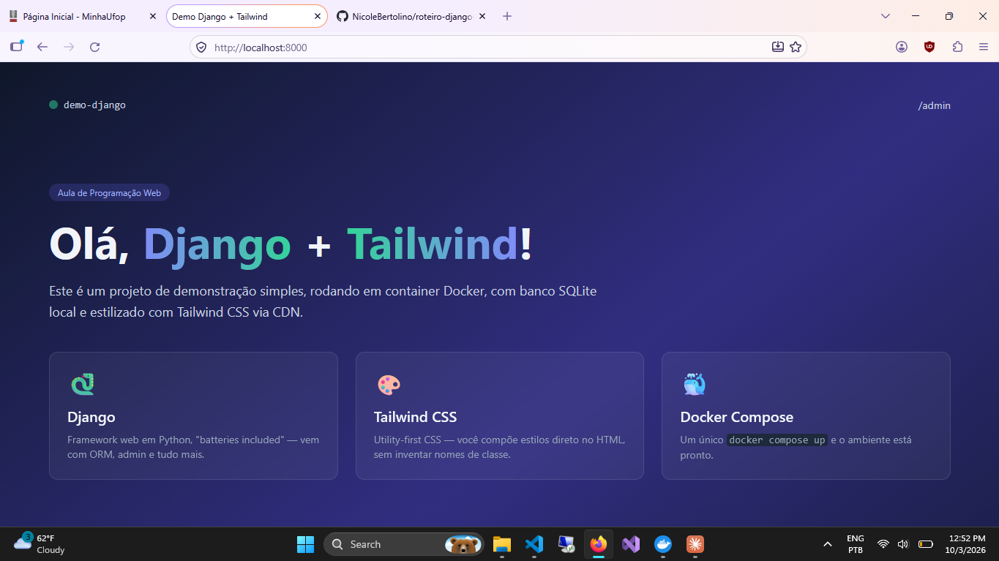
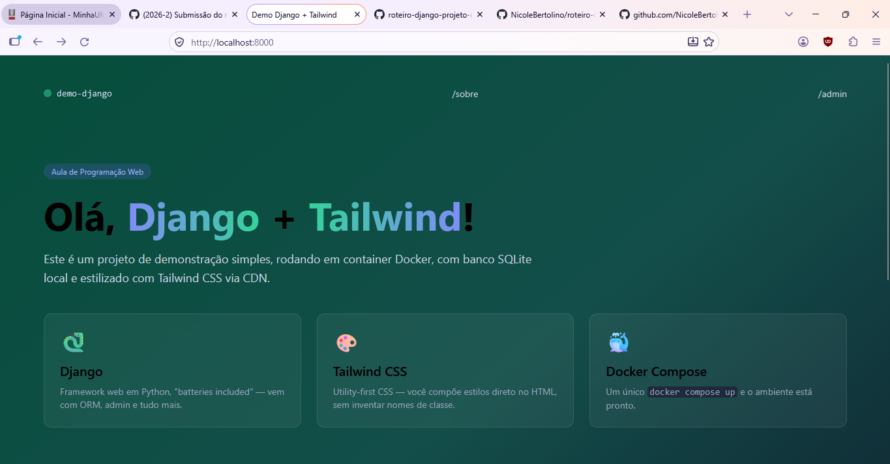
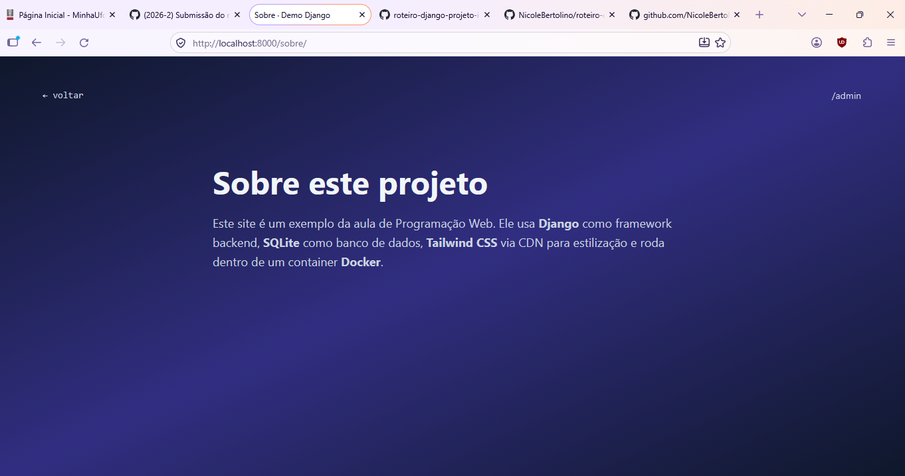

# Roteiro Django – Projeto Inicial

Trabalho de Programação Web utilizando **Django + Tailwind CSS + Docker**.

## Identificação

- **Nome:** Nicole Bertolino Lamounier Santos
- **Matrícula:** 22.2.4066
- **Curso:** Ciência da Computação
- **Disciplina:** Programação Web

## Resultado
### Imagem referentes a primeira prática


### Imagens referentes a segunda prática



## Como executar

```bash
docker compose up --build
```

Depois, acesse http://localhost:8000.